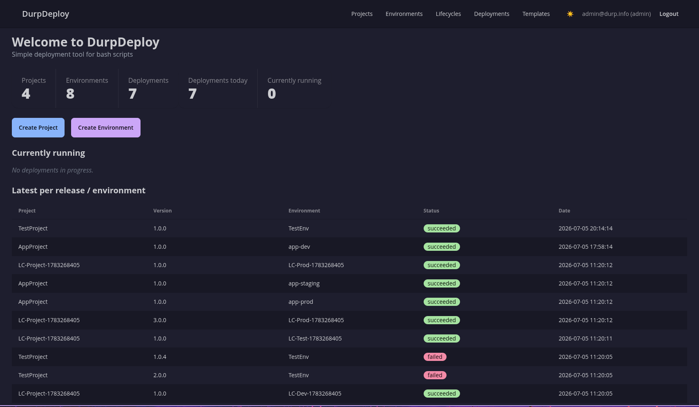

# DurpDeploy

A single-binary deployment tool for running bash scripts against environments. Define projects, write deployment steps, manage environment-scoped variables, create immutable releases, and deploy them with live log streaming in the browser.

*** This Application is a test of "Vibe Coding" and what can and cannot be done with AI ***



## Features

- **Projects** - Organize deployments into projects
- **Environments** - Define deployment targets (dev, staging, prod) with tags
- **Steps** - Ordered bash scripts that run sequentially during deployment
- **Variables** - Key/value pairs scoped to environments, resolved at deploy time
- **Releases** - Immutable snapshots of steps + variables with version numbers
- **Deployments** - Execute releases against environments with live SSE log streaming
- **Cancel** - Stop running deployments mid-execution

## Quick Start

### Prerequisites

- Go 1.25+
- Node.js (for Tailwind CSS build)
- [templ CLI](https://templ.guide/quick-start/installation)
- [sqlc](https://docs.sqlc.dev/en/latest/overview/install.html) (only if modifying queries)

### Build

```bash
npm install
make build
```

This produces a single `durpdeploy` binary.

### Run

```bash
./durpdeploy
```

Server starts on `http://localhost:8080`. A `durpdeploy.db` SQLite file is created automatically on first run.

## Usage

1. **Create a project** - Navigate to Projects → New Project
2. **Add steps** - On the project detail page, add bash script steps in order
3. **Create environments** - Navigate to Environments → New Environment (e.g., "Production" with tag `prod`)
4. **Add variables** - On the project detail page, click Variables. Add key/value pairs scoped to environments
5. **Create a release** - On the project detail page, click Releases. Enter a version (e.g., `1.0.0`)
6. **Deploy** - On the release, select an environment and click Deploy. Watch logs stream in real time.

## Architecture

```
cmd/server/main.go        Entry point
internal/
  handler/                HTTP handlers (chi routes)
  repository/             Thin wrapper around sqlc-generated queries
  runner/                 Deployment execution engine + SSE log broker
  server/                 Router setup
  migrate/                Goose migration runner
migrations/               SQL schema migrations
queries/                  sqlc query definitions
views/                    Templ templates (pages, components, layouts)
static/                   Embedded static assets (JS, CSS)
```

**Stack:** Go + chi + SQLite (modernc.org/sqlite) + sqlc + goose + Templ + HTMX + Alpine.js + Tailwind CSS + DaisyUI

## Development

```bash
# Generate templ files
make templ-generate

# Build Tailwind CSS
make tailwind-build

# Full build
make build

# Run with hot-reload (requires air or similar)
make dev
```

## Production Deploy

For a small team deployment, DurpDeploy runs as a single Go process behind
Caddy, which terminates HTTPS and reverse-proxies to `localhost:8080`. The
binary ships with argon2id password hashing, DB-backed session auth, CSRF
protection on every state-changing request, and an audit log. See
[`docs/deploy.md`](docs/deploy.md) for the full runbook — provisioning a fresh
Debian 12 VM end to end takes about 20 minutes.

The first admin user is created with a one-shot CLI command (no server running
required). The password is hashed with argon2id and stored in the `users`
table; nothing in the DB is plaintext:

```bash
durpdeploy admin create --email admin@example.com --password '<strong-password>'
```

The database path is configurable via the `DURPDEPLOY_DB` env var; it defaults
to `durpdeploy.db` in the current directory for local dev. Production sets it
to `/var/lib/durpdeploy/durpdeploy.db` via the systemd unit.

## Roles

Three roles, set at user-creation time and stored in `users.role`:

| Role       | Reads                          | Writes                                                | Sees audit log |
|------------|--------------------------------|-------------------------------------------------------|----------------|
| `admin`    | Everything                     | Everything                                            | Yes (`/admin/audit`) |
| `deployer` | Everything                     | Everything — same writes as `admin`                   | No             |
| `viewer`   | Everything                     | Nothing — every POST/PUT/PATCH/DELETE returns 403     | No             |

**Until P1-1 lands, any `deployer` can deploy to any project** — there is no
per-project membership check yet. The practical "least privilege" is to make
non-admins `viewer` if they don't need to trigger deploys. Full details in
[`docs/roles.md`](docs/roles.md).

## Security

The threat model — what DurpDeploy defends against, what it doesn't, and the
five-minute hands-on attack drill — is documented in
[`docs/attack-drill.md`](docs/attack-drill.md). The summary:

- **Defends against:** unauthenticated deploys, CSRF on a teammate's browser,
  password DB leak (argon2id, per-user salt, ~100ms per guess).
- **Does NOT defend against yet:** per-project authorization (P1-1), secret
  encryption at rest (P1-2, `release_variables.value` is plaintext today),
  runner sandboxing (P1-3, steps run as the server's user).

## What It Does Not Do

- No remote deployment targets or SSH
- No parallel step execution
- No CI/build features
- No Kubernetes or cloud integrations
- No PowerShell support (bash only)

## License

MIT
