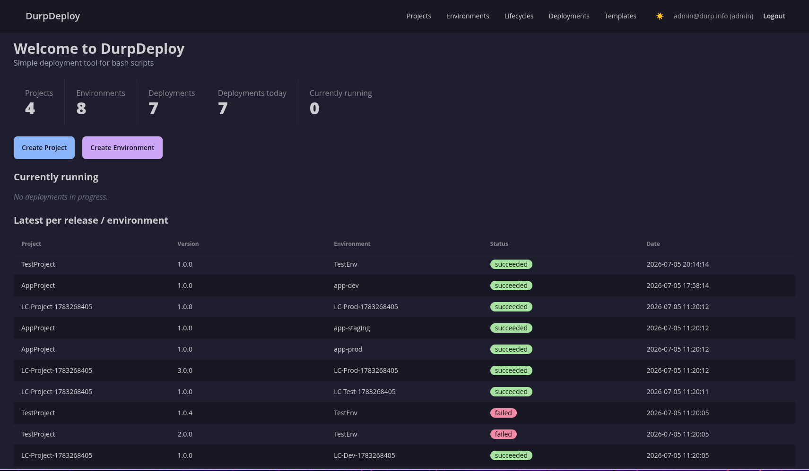

# DurpDeploy

A single-binary deployment tool for running bash scripts against environments. Define projects, write deployment steps, manage environment-scoped variables, create immutable releases, and deploy them with live log streaming in the browser.



## Features

- **Projects** - Organize deployments into projects
- **Environments** - Define deployment targets (dev, staging, prod) with tags
- **Steps** - Ordered bash scripts that run sequentially during deployment
- **Variables** - Key/value pairs scoped to environments, resolved at deploy time
- **Releases** - Immutable snapshots of steps + variables with version numbers
- **Deployments** - Execute releases against environments with live SSE log streaming
- **Approvals** - Manual gate for production deployments requiring admin sign-off
- **Notifications** - Event-driven Slack, Email, Gotify, and Discord alerts for deployment status
- **Cancel** - Stop running deployments mid-execution
- **Remote agents** - Dispatch deployments to outbound-only agents with mTLS and certificate pinning

For the complete server listener, admin pairing, agent installation, and
recovery procedure, see [`docs/agents.md`](docs/agents.md).

## Quick Start

### Prerequisites

- Go 1.25+
- Node.js (for Tailwind CSS build)
- [templ CLI](https://templ.guide/quick-start/installation)
- [sqlc](https://docs.sqlc.dev/en/latest/overview/install.html) (only if modifying queries)

### Build

```bash
npm install
make build
```

This produces a single `durpdeploy` binary.

### Run

```bash
./durpdeploy
```

Server starts on `http://localhost:8080`. A `durpdeploy.db` SQLite file is created automatically on first run.

## Usage

1. **Create a project** - Navigate to Projects → New Project
2. **Add steps** - On the project detail page, add bash script steps in order
3. **Create environments** - Navigate to Environments → New Environment (e.g., "Production" with tag `prod`)
4. **Add variables** - On the project detail page, click Variables. Add key/value pairs scoped to environments
5. **Create a release** - On the project detail page, click Releases. Enter a version (e.g., `1.0.0`)
6. **Deploy** - On the release, select an environment and click Deploy. Watch logs stream in real time.

## API

DurpDeploy exposes a JSON REST API at `/api/v1/*`. All requests must authenticate with a bearer token:

```bash
curl -H "Authorization: Bearer ddp_pat_<token>" http://localhost:8080/api/v1/projects
```

API tokens are created per-user from the `/settings/tokens` page or via the CLI:

```bash
durpdeploy tokens create --user admin@example.com --name ci
```

Browser MFA protects browser sessions only. API tokens remain single bearer
credentials and are not MFA-protected; an MFA reset does not revoke them.

### Optional OIDC sign-in

OIDC is optional. Enable it only with the complete configuration below:

```text
DURPDEPLOY_URL=https://<public-host>
DURPDEPLOY_OIDC_ISSUER=https://<issuer-host>
DURPDEPLOY_OIDC_CLIENT_ID=<client-id>
DURPDEPLOY_OIDC_CLIENT_SECRET=<secret>
DURPDEPLOY_OIDC_ADMIN_GROUP=<admin-group>
DURPDEPLOY_OIDC_DEPLOYER_GROUP=<deployer-group>
DURPDEPLOY_OIDC_VIEWER_GROUP=<viewer-group>
DURPDEPLOY_OIDC_DISPLAY_NAME=<display-name>
DURPDEPLOY_OIDC_GROUP_CLAIM=<claim-name>
DURPDEPLOY_OIDC_REQUIRE_EMAIL_VERIFIED=<true|false>
```

The issuer and public URL must be HTTPS origins. Register the exact redirect URI
`DURPDEPLOY_URL + /login/oidc/callback` with the provider. The requested scopes
are `openid`, `profile`, and `email`. The local password form remains available
alongside OIDC, and password login uses the most recently stored local role.

When unset, or set to `true`, the callback requires the ID token to contain the
literal JSON boolean `email_verified: true`. Explicit lowercase
`DURPDEPLOY_OIDC_REQUIRE_EMAIL_VERIFIED=false` accepts a present literal JSON
boolean `email_verified: true` or `email_verified: false`, after normal ID token
signature, issuer, audience, and nonce verification. Missing, null, string, and
numeric claims remain rejected. This weakens identity assurance, so use it only
where Authentik independently establishes address ownership. The first email match links to
the one local account with that email. If no account matches, OIDC creates a
user with an empty password, so that user must continue using OIDC.
Configured groups map to roles with admin, then deployer, then viewer precedence.
Each successful OIDC login synchronizes the stored name, email, and role. A role
change deletes that user's browser sessions. Removing a group is observed on the
next OIDC login only. There is no SCIM or provider back-channel deprovisioning.

OIDC reauthentication is handled by the identity provider, while the application
binds the result to the existing local session and OIDC identity. Logout is local
only: it clears the DurpDeploy browser session and does not log out of the
provider. DurpDeploy does not persist provider tokens, authorization codes, or
raw claims, and OIDC does not authenticate API tokens. If the provider is down,
the password login, existing sessions, health endpoint, and bearer API remain
available. An OIDC-created account can be recovered by an administrator through
the normal local user recovery process; there is no self-service password reset.

The full API reference is available at `/api/swagger/` in a running server (no auth required).

## Architecture

```
cmd/server/main.go        Entry point
internal/
  handler/                HTTP handlers (chi routes)
  repository/             Thin wrapper around sqlc-generated queries
  runner/                 Deployment execution engine + SSE log broker
  server/                 Router setup
  migrate/                Goose migration runner
migrations/               SQL schema migrations
queries/                  sqlc query definitions
views/                    Templ templates (pages, components, layouts)
static/                   Embedded static assets (JS, CSS)
```

**Stack:** Go + chi + SQLite (modernc.org/sqlite) + sqlc + goose + Templ + HTMX + Alpine.js + Tailwind CSS + DaisyUI

## Development

```bash
# Generate templ files
make templ-generate

# Build Tailwind CSS
make tailwind-build

# Full build
make build

# Run with hot-reload behind an ephemeral Caddy HTTPS proxy (requires Docker)
make dev
```

`make dev`, `make dev-postgres`, and `make dev-mssql` keep the app on
`http://localhost:8080` and expose it through `https://localhost:8443`. The
proxy uses Caddy's self-signed internal CA, so accept the local browser warning
or use `curl -k`. It is removed automatically when the dev command exits.

Configure the ephemeral proxy without installing Caddy on the host:

```bash
DEV_HTTPS_PROXY_CONTAINER=my-dev-proxy \
DEV_HTTPS_PROXY_PORT=9443 \
DEV_HTTPS_PROXY_BACKEND=host.docker.internal:8080 make dev
```

The Linux Docker daemon must support `host-gateway`; startup fails clearly if
the host backend cannot be reached through that mapping.

`make e2e-test` exercises the SQLite database of an already-running server; it
does not build or start one. Override the target with
`DURPDEPLOY_BASE_URL=https://localhost:8443 make e2e-test` (the local internal
CA is accepted automatically) or set `DURPDEPLOY_DB` when the running SQLite
server uses a non-default database path. The harness expects the configured
`E2E_ADMIN_EMAIL` to already be an `admin`; if it is missing, it will use
`durpdeploy admin create` through `DURPDEPLOY_E2E_CLI` (defaulting to
`./durpdeploy` when that binary is executable). If the CLI path is unavailable,
build DurpDeploy first and set `DURPDEPLOY_E2E_CLI` to an executable binary.
For SQLite, start the server with WAL and `busy_timeout` enabled as in the
default DSN. Use
`make e2e-test-isolated` for the previous clean-room build-and-start workflow
used by CI.

## Production Deploy

For a small team deployment, DurpDeploy runs as a single Go process behind
Caddy, which terminates HTTPS and reverse-proxies to `localhost:8080`. The
binary ships with argon2id password hashing, DB-backed session auth, CSRF
protection on every state-changing request, and an audit log. See
[`docs/deploy.md`](docs/deploy.md) for the full runbook — provisioning a fresh
Debian 12 VM end to end takes about 20 minutes.

The first admin user is created with a one-shot CLI command (no server running
required). The password is hashed with argon2id and stored in the `users`
table; nothing in the DB is plaintext:

```bash
durpdeploy admin create --email admin@example.com --password '<strong-password>'
```

The database path is configurable via the `DURPDEPLOY_DB` env var; it defaults
to `durpdeploy.db` in the current directory for local dev. Production sets it
to `/var/lib/durpdeploy/durpdeploy.db` via the systemd unit.

Set `DURPDEPLOY_URL=https://durpdeploy.example.com` in production. This is the
fixed browser origin and passkey RP identity; changing its hostname or origin
invalidates existing passkeys. Users can optionally enroll browser MFA from
Security and must store one-time recovery codes securely when displayed.

## Roles

Three roles, set at user-creation time and stored in `users.role`:

| Role       | Reads                          | Writes                                                | Sees audit log |
|------------|--------------------------------|-------------------------------------------------------|----------------|
| `admin`    | Everything                     | Everything                                            | Yes (`/admin/audit`) |
| `deployer` | Everything                     | Everything — same writes as `admin`                   | No             |
| `viewer`   | Everything                     | Nothing — every POST/PUT/PATCH/DELETE returns 403     | No             |

**Per-project authorization is enforced** — every project has a `project_members`
row for each user who can read or write to it. Global admins bypass the
check; non-admins must be a member. A non-member hitting a project-scoped
route gets 404 (to hide existence) or 403 (depending on the route). The
practical "least privilege" is to make non-admins `viewer` if they don't
need to trigger deploys. Full details in [`docs/roles.md`](docs/roles.md).

## Security

The threat model — what DurpDeploy defends against, what it doesn't, and the
five-minute hands-on attack drill — is documented in
[`docs/attack-drill.md`](docs/attack-drill.md). The summary:

- **Defends against:** unauthenticated deploys, CSRF on a teammate's browser,
  password DB leak (argon2id, per-user salt, ~100ms per guess), cross-project
  write access (per-project `project_members` — P1-1), secret-at-rest
  exposure (AES-256-GCM for `variables` and `release_variables.value` —
  P1-3), rogue step scripts (dedicated user + cgroup sandbox + minimal env
  — P1-4), naive log redaction (regex-based scrubber for literal secrets,
  common credential patterns, and split writes — P1-5), unrecoverable
  data loss (Litestream continuous WAL replication + monthly restore drill
  — P1-6), and unauthorized approval of `pending_approval` deployments
  (admin-only gate on `/deployments/{id}/approve` — P2-1; the stored
  `required_approver_role` is descriptive only, the real gate is the handler
  check).
- **Partially defends against:** backup monitoring (P2-4 — the binary polls
  a user-supplied check command and fires `BackupUnhealthy` on failure,
  but does not enforce the originally planned 36h age threshold). Audit
  retention (P2-5 — `audit prune --days N` ships and preserves rows tied
  to live deployments/releases, but the default 180-day window and the
  daily systemd timer are operator-deployed, not auto-installed).

## What It Does Not Do

- No SSH-based deployment transport
- No parallel step execution
- No CI/build features
- No Kubernetes or cloud integrations
- No PowerShell support (bash only)

## License

MIT
