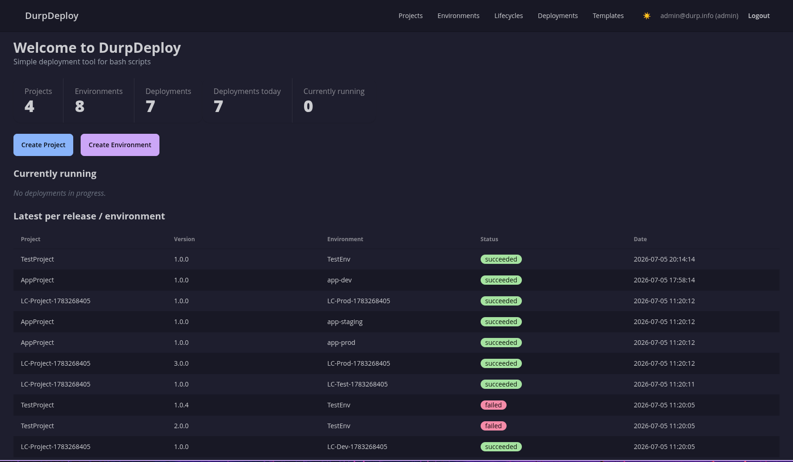

# DurpDeploy

A single-binary deployment tool for Bash, PowerShell, and Python scripts.
Organize projects and environments, capture releases, and deploy with live logs.



## What it does

- Ordered script steps, environment-scoped variables, and secret masking.
- Release snapshots of steps and variables. Refresh affects future deployments;
  existing deployment snapshots stay frozen.
- Deployment approvals, cancellation, verification, rollback, and schedules.
- Remote agent fan-out over pinned mTLS, with environment and capability routing.
- Reusable templates, runbooks, package repositories, and artifact approval.
- Slack, email, Gotify, and Discord notifications.
- Browser sessions, optional MFA/OIDC, bearer API tokens, and an audit log.

## Local quick start

Install Go 1.26+, Node.js, the [templ CLI](https://templ.guide/quick-start/installation),
and Docker or Podman. Build and start the development HTTPS proxy:

```bash
npm ci
make build
make dev
```

In another terminal, create the first administrator:

```bash
./durpdeploy admin create --email admin@example.com --password '<strong-password>'
```

Open `https://localhost:8443`. Trust the temporary CA printed by `make dev`.
The backend listens on `http://localhost:8080` and uses `durpdeploy.db` by default.
Keep the development encryption key with that database.
See [development and testing](docs/development.md) for other databases,
proxy options, generated assets, and test commands. Use `make demo` for a populated
instance with a paired agent and retained manual-test fixtures.

## Deployment workflow

1. Create a project and its ordered script steps.
2. Create environments and add environment-scoped variables.
3. Create a release to capture the project configuration.
4. Select an environment and deploy the release.
5. Follow logs and approvals, then inspect verification results.

Server steps require a container image and a ready Docker/Podman runtime.
Step containers receive no runtime socket or control-plane mount. A remote step
runs on every matching active agent; there is no local fallback.

## API and agents

The JSON API lives at `/api/v1`. Create a user token in **Settings → Tokens**
or with the CLI, then send it as a bearer credential:

```bash
./durpdeploy tokens create --user admin@example.com --name ci
curl -H 'Authorization: Bearer ddp_pat_<token>' http://localhost:8080/api/v1/projects
```

Browser MFA protects browser sessions only. API tokens remain single bearer
credentials; an MFA reset does not revoke them. The public Swagger reference
is at `/api/swagger/` on a running server.

External agents can discover the shipped [operator skill](skills/durpdeploy/SKILL.md)
at `/.well-known/skills/index.json` or `/.well-known/agent-skills/`.
For opencode, add `skills: { urls: ["https://your-host/.well-known/skills/"] }`,
or copy the served skill into `~/.config/opencode/skills/durpdeploy/SKILL.md`.

Remote agents support `agent/1`, `agent/2`, and `agent/3`. The `v0.1.0` source tag
remains Bash-only compatible. Container steps require `agent/3`; older protocols
are host-only. Preserve paired state when upgrading.

## Guides

| Task | Guide |
| --- | --- |
| Install with Compose | [Deployment](docs/deploy.md) |
| Install on Kubernetes | [Helm chart](charts/durpdeploy/README.md) |
| Configure remote agents | [Agent operations](docs/agents.md) and [protocol](docs/agent-protocol.md) |
| Back up, restore, or prune audit logs | [Backup and maintenance](docs/backup-restore.md) |
| Set up optional OIDC | [OIDC / Authentik](docs/authentik-oidc.md) |
| Assign user permissions | [Roles](docs/roles.md) |
| Configure notifications | [Notifications](docs/notifications.md) |
| Review generated plans | [Artifact approval](docs/artifact-approval.md) |
| Understand security boundaries | [Security](docs/security.md) and [attack drill](docs/attack-drill.md) |
| Reproduce CI security gates | [Security scanning](docs/security-scanning.md) |
| Build and test | [Development](docs/development.md), [manual E2E](docs/manual-e2e.md), [mobile CI](docs/mobile-browser-ci.md) |
| Change the UI | [Design system](DESIGN.md) |

## Limits

- No SSH-based deployment targets.
- No parallel step execution or CI/build pipeline.
- No Kubernetes-native execution backend. The chart hosts the server;
  use standalone agents for executable steps.
- Container execution shares the runtime host's kernel. Runtime socket access
  grants host authority. Trust script authors and isolate execution hosts.

**Stack:** Go, chi, SQLite/PostgreSQL/SQL Server, sqlc, goose, templ,
HTMX, Alpine.js, Tailwind CSS, and DaisyUI. **License:** MIT.
